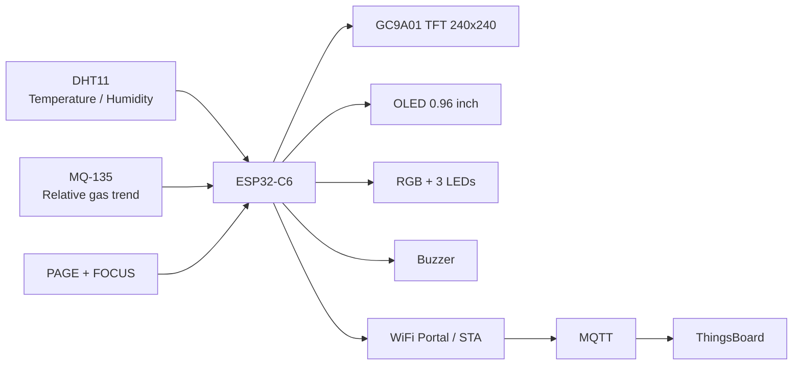

# HP14 — Deep Work Environment Monitor

> Thiết bị IoT dùng ESP32-C6 để theo dõi môi trường làm việc theo thời gian thực, hỗ trợ người dùng nhận biết khi nào không gian phù hợp hơn cho **Deep Work**.


**Phiên bản hiện tại:** `v1.1.0-wifi-portal-stable`  
**Bo mạch:** ESP32-C6 Dev Module  
**Ngôn ngữ:** Arduino/C++  
**Giao tiếp đám mây:** MQTT → ThingsBoard

[English overview](README_EN.md)

---

## 1. HP14 giải quyết vấn đề gì?

HP14 biến một bộ cảm biến rời rạc thành một **giao diện môi trường làm việc có thể hiểu và tương tác**:

- Đo nhiệt độ, độ ẩm và nhiệt độ cảm nhận.
- Theo dõi xu hướng khí tương đối bằng MQ-135.
- Tính điểm Deep Work thử nghiệm theo trạng thái môi trường.
- Hiển thị trực tiếp trên TFT tròn và OLED.
- Phản hồi bằng LED, RGB, còi và hai nút bấm.
- Gửi telemetry lên ThingsBoard để theo dõi lịch sử.
- Cho phép đổi WiFi tại địa điểm mới mà không cần sửa code.
- Có chế độ phiên tập trung cục bộ bằng nút `FOCUS`.

HP14 được thiết kế cho quá trình nghiên cứu trải nghiệm không gian trong bối cảnh **khí hậu nóng ẩm**, nhưng các ngưỡng hiện tại vẫn là ngưỡng UX thử nghiệm, không phải kết luận y khoa.

---

## 2. Điểm nổi bật của v1.1.0

### WiFi Portal ổn định

Giữ đồng thời `PAGE + FOCUS` trong 5 giây để mở mạng cấu hình:

```text
SSID: HP14-SETUP-xxxx
Password: 12345678
Portal: http://192.168.4.1
```

Cơ chế mới:

1. Quét WiFi đúng một lần trước khi phát Access Point.
2. Danh sách mạng được cache; HTTP handler không quét lại.
3. WiFi mới được lưu ở vùng `pending`.
4. Chỉ thay cấu hình chính sau khi kết nối mạng mới thành công.
5. Nếu mạng mới thất bại, cấu hình cũ vẫn được giữ.

### Giao diện hai nút rõ ràng

| Nút | Chức năng |
|---|---|
| `PAGE` — GPIO1 | Chuyển trang hiển thị |
| `FOCUS` — GPIO11 | Bắt đầu/kết thúc phiên Deep Work |
| Giữ cả hai 5 giây | Mở WiFi Setup Portal |

### TFT tròn không reset theo chu kỳ

- Hardware SPI 20 MHz.
- Controller chỉ reset khi khởi động.
- Bốn trang: Deep Work, Thermal, Air Trend, System.
- MQ-135 có đồ thị xu hướng 48 mẫu.

---

## 3. Kiến trúc hệ thống



---

## 4. Phần cứng

### Thành phần chính

- ESP32-C6 Dev Module, board 30 chân.
- DHT11.
- MQ-135 module.
- OLED 0.96 inch I²C, địa chỉ `0x3C` hoặc `0x3D`.
- TFT tròn GC9A01 240×240 SPI.
- Hai nút bấm.
- Ba LED ngoài: xanh, vàng, đỏ.
- RGB LED tích hợp trên board.
- Buzzer 5V qua transistor NPN.
- Điện trở 220Ω, 1kΩ, 10kΩ.

### Bản đồ GPIO đã khóa

| Chức năng | GPIO |
|---|---:|
| TFT RST | 0 |
| PAGE button | 1 |
| MQ-135 AO qua cầu chia 10kΩ/10kΩ | 2 |
| DHT11 DATA | 3 |
| OLED SDA | 6 |
| OLED SCL | 7 |
| RGB onboard | 8 |
| LED đỏ | 10 |
| FOCUS button | 11 |
| Buzzer control | 15 |
| TFT CLK | 18 |
| TFT MOSI | 19 |
| TFT CS | 20 |
| TFT DC | 21 |
| LED xanh | 22 |
| LED vàng | 23 |

Chi tiết đấu dây: [docs/WIRING.md](docs/WIRING.md)

---

## 5. Cấu trúc repository

```text
HP14-Deep-Work-Environment-Monitor/
├── HP14/
│   ├── HP14.ino
│   ├── config.h
│   └── secrets.example.h
├── docs/
│   ├── WIRING.md
│   ├── WIFI_PROVISIONING.md
│   ├── THINGSBOARD.md
│   └── TROUBLESHOOTING.md
├── CHANGELOG.md
├── RELEASE_NOTES_v1.1.0.md
├── CONTRIBUTING.md
├── SECURITY.md
├── GITHUB_METADATA.md
├── GITHUB_PUBLISHING_GUIDE.md
└── README.md
```

`secrets.h` không được đưa lên GitHub.

---

## 6. Cài đặt firmware

### Yêu cầu

- Arduino IDE 2.3.x.
- ESP32 board package by Espressif Systems, đã kiểm thử với `3.3.10`.
- Board: `ESP32C6 Dev Module`.
- `USB CDC On Boot: Enabled`.
- Serial Monitor: `115200 baud`.

### Thư viện

Cài bằng Arduino Library Manager:

- Adafruit GFX Library.
- Adafruit SSD1306.
- Adafruit GC9A01A.
- Adafruit NeoPixel.
- Adafruit Unified Sensor.
- DHT sensor library tương thích `DHT.h` và `DHT_U.h`.
- PubSubClient.

Các thư viện `WiFi`, `WebServer`, `DNSServer`, `Preferences`, `SPI`, `Wire` đi kèm ESP32 core.

### Tạo file bảo mật

Sao chép:

```text
HP14/secrets.example.h
```

thành:

```text
HP14/secrets.h
```

Sau đó điền:

```cpp
#define WIFI_SSID     "YOUR_2_4_GHZ_WIFI"
#define WIFI_PASSWORD "YOUR_WIFI_PASSWORD"

#define TB_HOST  "mqtt.thingsboard.cloud"
#define TB_PORT  1883
#define TB_TOKEN "YOUR_THINGSBOARD_DEVICE_TOKEN"
```

Mở `HP14/HP14.ino`, Verify và Upload.

---

## 7. Đổi WiFi tại địa điểm mới

1. Giữ `PAGE + FOCUS` đủ 5 giây.
2. Kết nối điện thoại vào `HP14-SETUP-xxxx`.
3. Chọn tiếp tục dùng mạng dù điện thoại báo không có Internet.
4. Mở `http://192.168.4.1`.
5. Chọn WiFi 2.4 GHz mới và nhập mật khẩu.
6. Nhấn lưu.
7. HP14 khởi động lại, thử mạng mới và chỉ commit khi kết nối thành công.

Hướng dẫn đầy đủ: [docs/WIFI_PROVISIONING.md](docs/WIFI_PROVISIONING.md)

---

## 8. ThingsBoard telemetry

HP14 gửi dữ liệu tới:

```text
v1/devices/me/telemetry
```

Nhóm telemetry chính:

| Key | Ý nghĩa |
|---|---|
| `temperature` | Nhiệt độ °C |
| `humidity` | Độ ẩm %RH |
| `heatIndex` | Nhiệt độ cảm nhận °C |
| `mq135Raw` | ADC raw |
| `mq135FilteredMv` | Điện áp đã lọc |
| `mq135BaselineMv` | Baseline tương đối |
| `gasRatioRelative` | Tỷ lệ khí so với baseline |
| `thermalScoreExperimental` | Điểm nhiệt thử nghiệm |
| `dwScoreExperimental` | Điểm Deep Work thử nghiệm |
| `environmentState` | Trạng thái hệ thống |
| `focusSessionActive` | Phiên tập trung đang chạy |
| `wifiPortalActive` | Portal cấu hình đang mở |
| `firmwareVersion` | Phiên bản firmware |

Danh sách đầy đủ: [docs/THINGSBOARD.md](docs/THINGSBOARD.md)

---

## 9. Serial commands

Mở Serial Monitor ở `115200 baud`:

| Lệnh | Chức năng |
|---|---|
| `n` | Chuyển trang |
| `a` | Bắt đầu/kết thúc Focus Session |
| `b` | Test buzzer |
| `l` | Test LED |
| `t` | Test màu TFT |
| `c` | Học lại baseline MQ-135 sau warm-up |
| `w` | Mở WiFi Portal |
| `p` | In bản đồ chân |

---

## 10. Giới hạn và cảnh báo

- MQ-135 trong HP14 chỉ dùng để theo dõi **xu hướng khí tương đối**.
- Không diễn giải MQ-135 thành CO₂, PM2.5, AQI hoặc nồng độ khí tuyệt đối khi chưa hiệu chuẩn bằng thiết bị chuẩn.
- Điểm Deep Work và các ngưỡng nhiệt là chỉ số UX thử nghiệm, không phải chẩn đoán y khoa hoặc chứng nhận chất lượng không khí.
- DHT11 có độ chính xác và tốc độ giới hạn; đặt cảm biến cách xa bộ nung MQ-135, ESP32, màn hình và nguồn nhiệt.
- Module GC9A01 hiện dùng không có touch controller, nên TFT không phải màn hình cảm ứng.
- Buzzer 5V phải điều khiển qua transistor; không cấp tải trực tiếp từ GPIO.

---

## 11. Roadmap

- Thay DHT11 bằng SHT31/BME280.
- Bổ sung cảm biến CO₂ NDIR.
- Bổ sung PM2.5 kỹ thuật số.
- Tách điểm nhiệt, khí, tiếng ồn và ánh sáng thành các chỉ số độc lập.
- Remote attributes/RPC từ ThingsBoard.
- OTA firmware update.
- Thiết kế enclosure tối ưu luồng khí và cách nhiệt cảm biến.

---

## 12. Bảo mật

- Không commit `secrets.h`.
- Không đăng ảnh chứa ThingsBoard token, mật khẩu WiFi hoặc SSID riêng tư.
- Khi vô tình đẩy token lên GitHub, hãy thu hồi token trên ThingsBoard và tạo token mới.

Xem [SECURITY.md](SECURITY.md).

---

## 13. License

Repository này chưa áp dụng giấy phép mã nguồn chính thức. Trước khi phát hành công khai, chủ dự án cần chọn giấy phép phù hợp. Xem [LICENSE_NOTICE.md](LICENSE_NOTICE.md).
