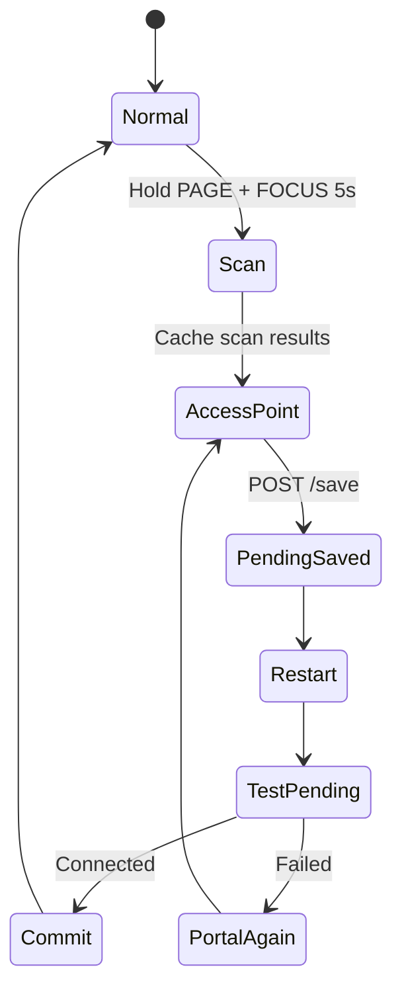

# WiFi Provisioning — HP14 v1.1.0

## Mục tiêu

Cho phép HP14 chuyển sang WiFi 2.4 GHz tại địa điểm mới mà không sửa `secrets.h` hoặc nạp lại firmware.

## Luồng người dùng

1. Giữ đồng thời `PAGE + FOCUS` trong 5 giây.
2. HP14 quét mạng đúng một lần.
3. HP14 phát `HP14-SETUP-xxxx`.
4. Điện thoại kết nối bằng mật khẩu `12345678`.
5. Mở `http://192.168.4.1`.
6. Chọn mạng mới và nhập mật khẩu.
7. HP14 lưu thông tin mới vào vùng pending rồi khởi động lại.
8. HP14 thử kết nối mạng pending.
9. Chỉ khi thành công, mạng pending mới trở thành cấu hình chính.

## Vì sao dùng vùng pending?

Nếu mật khẩu mới sai hoặc router không khả dụng, firmware không ghi đè ngay cấu hình cũ. Điều này giảm nguy cơ thiết bị bị mất kết nối hoàn toàn sau một lần nhập sai.

## Kiến trúc portal



## Log thành công

```text
[PORTAL] Scanning WiFi before AP starts...
[PORTAL] Cached N WiFi networks.
[PORTAL] Stable AP started ...
[PORTAL] /save received ...
[PORTAL] Pending SSID=... saved ...

[WiFi] Pending candidate found: ...
[WiFi] Connected SSID=... IP=...
[WiFi] New WiFi committed: ...
```

## Lưu ý trên điện thoại

- Chọn “Vẫn kết nối” hoặc “Use without Internet”.
- HP14-SETUP là mạng cấu hình nội bộ, không có Internet.
- Nếu captive portal không tự mở, truy cập thủ công `192.168.4.1`.
- Chỉ sử dụng WiFi 2.4 GHz; ESP32-C6 không kết nối WiFi 5 GHz.

## Khắc phục sự cố

### Thấy AP nhưng không mở được trang

- Tắt mobile data tạm thời.
- Mở trình duyệt ở chế độ riêng tư.
- Gõ trực tiếp `http://192.168.4.1`.
- Xác nhận điện thoại vẫn đang nối `HP14-SETUP-xxxx`.

### Không thấy `/save received`

Form chưa đến ESP32. Kiểm tra điện thoại có tự chuyển về WiFi Internet khác hay không.

### Mạng mới không được commit

- Sai mật khẩu.
- WiFi là 5 GHz.
- RSSI quá yếu.
- Router chặn thiết bị mới.
- Captive/enterprise WiFi cần đăng nhập web, không được hỗ trợ.

### Portal mở lại sau reboot

Điều này có nghĩa candidate mới không kết nối thành công. Nhập lại mật khẩu hoặc chọn mạng khác.
